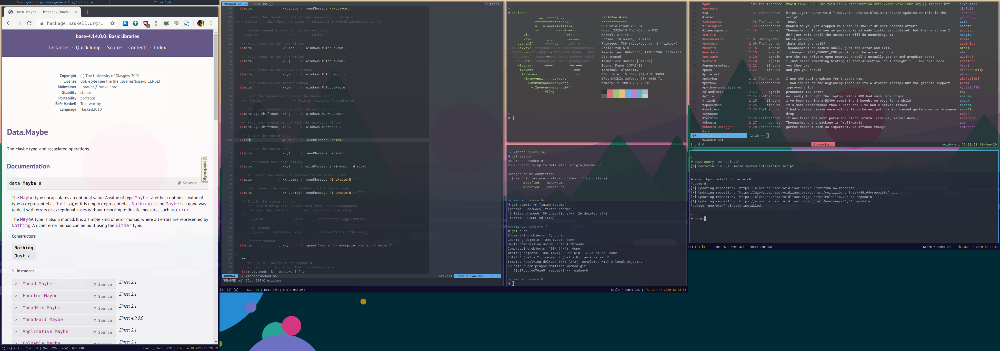

# dotfiles-xmonad

This repo contains my xmonad configuartion, it is work in progress.
I will be adding and modifying things until I get everything set up the way I
want it and hopefully learn some haskell along the way.

## Keybindings

The `Mod` key is set to <kbd>Super</kbd> (Windows key)

| Shortcut                                                        | Action                                |
|-----------------------------------------------------------------|---------------------------------------|
| <kbd>Mod</kbd> + <kbd>Enter</kbd>                               | Open terminal emulator (`alacritty`)  |
| <kbd>Mod</kbd> + <kbd>p</kbd>                                   | Open application laucher (`rofi`)     |
| <kbd>Mod</kbd> + <kbd>Shift</kbd> + <kbd>p</kbd>                | Open password manager (`rofi-pass`)   |
| <kbd>Mod</kbd> + <kbd>Shift</kbd> + <kbd>q</kbd>                | Close window                          |
| <kbd>Mod</kbd> + <kbd>Space</kbd>                               | Cycle trough layouts                  |
| <kbd>Mod</kbd> + <kbd>Tab</kbd>                                 | Focus next window                     |
| <kbd>Mod</kbd> + <kbd>j</kbd>                                   | Focus next window                     |
| <kbd>Mod</kbd> + <kbd>k</kbd>                                   | Focus previous window                 |
| <kbd>Mod</kbd> + <kbd>m</kbd>                                   | Focus master window                   |
| <kbd>Mod</kbd> + <kbd>Shift</kbd> + <kbd>j</kbd>                | Swap focused with next window         |
| <kbd>Mod</kbd> + <kbd>Shift</kbd> + <kbd>k</kbd>                | Swap focused with previous window     |
| <kbd>Mod</kbd> + <kbd>h</kbd>                                   | Shrink master window                  |
| <kbd>Mod</kbd> + <kbd>l</kbd>                                   | Expand master window                  |
| <kbd>Mod</kbd> + <kbd>t</kbd>                                   | Push window back to tiling            |
| <kbd>Mod</kbd> + <kbd>,</kbd>                                   | Increment number of windows in master |
| <kbd>Mod</kbd> + <kbd>.</kbd>                                   | Decrement number of windows in master |
| <kbd>Mod</kbd> + <kbd>q</kbd>                                   | Recompile and restart xmonad          |
| <kbd>Mod</kbd> + <kbd>1</kbd> .. <kbd>9</kbd>                   | Switch to workspace 1..9              |
| <kbd>Mod</kbd> + <kbd>Shift</kbd>+ <kbd>1</kbd> .. <kbd>9</kbd> | Move focused window to workspace 1..9 |
| <kbd>Mod</kbd> + <kbd>Mouse left</kbd>                          | Float and move window                 |
| <kbd>Mod</kbd> + <kbd>Mouse right</kbd>                         | Resize floating window                |
| <kbd>Mod</kbd> + <kbd>Mouse middle</kbd>                        | Raise window to top of stack          |

## Layouts

The following layouts are configured for now:

- Master tiled horizontal (golden ratio)
- Master tiled vertical (golden ratio)
- Tabbed
- Fullscreen

## Multihead behaviour

Workspaces will be on the monitor on which they started. The configuration
should work out of the box with 1 .. n screens if they are detected correctly by
`xrandr`.

Switching to a workspace on a different screen than the current one, will change
focus to that workspace but *not* swap it with the current screen. This
behaviour is configured to be similar to `i3`'s multihead behaviour.

## Autostart applications

For convenience only `~/.xmonad/autostart.sh` is launched once on startup of
xmonad. Applications that should be autostarted can be includede here. Don't
forget the `&` after commands that will continue to run or the applications
below will never be reached.

At the moment the following application are configured for autostarting:

- Set default screenlayout (`~/.screenlayout/default.sh`)
- Set keyboard map (`setxkbmap us -variant colemak -option "caps:escape"`)
- Compositor (`picom --config ~/.config/picom/picom.conf &`)
- Wallpaper (`nitrogen --restore &`)

xmobar is started separately from the `startupHook` in xmonad's configuration.

## XMobar

The statusbar (`xmobar`) incudes some system information and a workspace
indicator. The workspace indicator will show only workspaces that have windows
on them by number. The currently focused workspace on the current screen is highlighted in color,
workspaces visible (on any screen) are wrapped with `[ ]`, workspaces visible on
other screens are wrapped with `( )`. The bar is shown on all screens, from the
respective screen's point of view.

## Dependencies

- xmobar
- rofi
- rofi-pass
- alacritty
- imagemagick (for screenshots)

## Appearance

The top of the configuration includes variables to define 16 colors. These will
be used throughout the configuration. The variables make adapting any
of the [base16 colorschemes](http://chriskempson.com/projects/base16/) easy.

The font is set to `Roboto Mono`. Make sure to have it installed or change the
`myFontName` variable accordingly.
